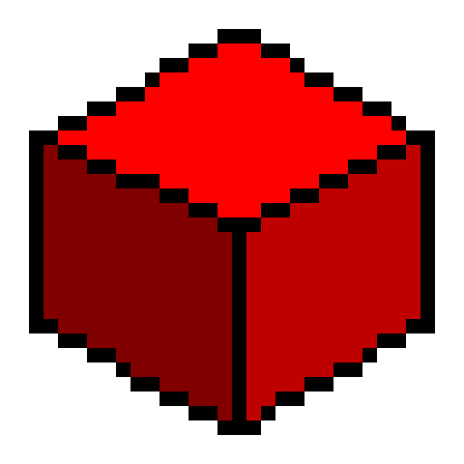

# Engine

  

Simple OpenGL renderer, written in c99 using GLFW and GLAD.
The main purpose of the engine is first-person games (like doom and quake).

>
Demo scene.

You can check out the `.md` files in the `docs` folder to get familiar with the engine SDK.
For a more in-depth look at the engine architecture, check out the `docs/code` file.

## Features

* Loading a models from a custom model format
* Building the world in sectors like doom

## Plans

* Player and world collision
* Sound
* Enemies
* Level loading
* and much more...

## Libraries

### GLFW

GLFW is an Open Source, multi-platform library for OpenGL, OpenGL ES and Vulkan development on the desktop.
It provides a simple API for creating windows, contexts and surfaces, receiving input and events.\
<https://www.glfw.org/>

### GLAD

Multi-Language GL/GLES/EGL/GLX/WGL Loader-Generator based on the official specs.\
<https://glad.dav1d.de/>

### stb

Single-file public domain (or MIT licensed) libraries for C/C++.\
<https://github.com/nothings/stb>

### kmatrix

`kmatrix` - (kvadrat matrix) math library written by me containing only the necessary functions, intended to replace cglm due to its large size and long compilation time.\
`lib/kmatrix`

## Links

Youtube channel: <https://www.youtube.com/@kraskvad>\
Telegram channel: <https://t.me/krasnyykvadratdev>
