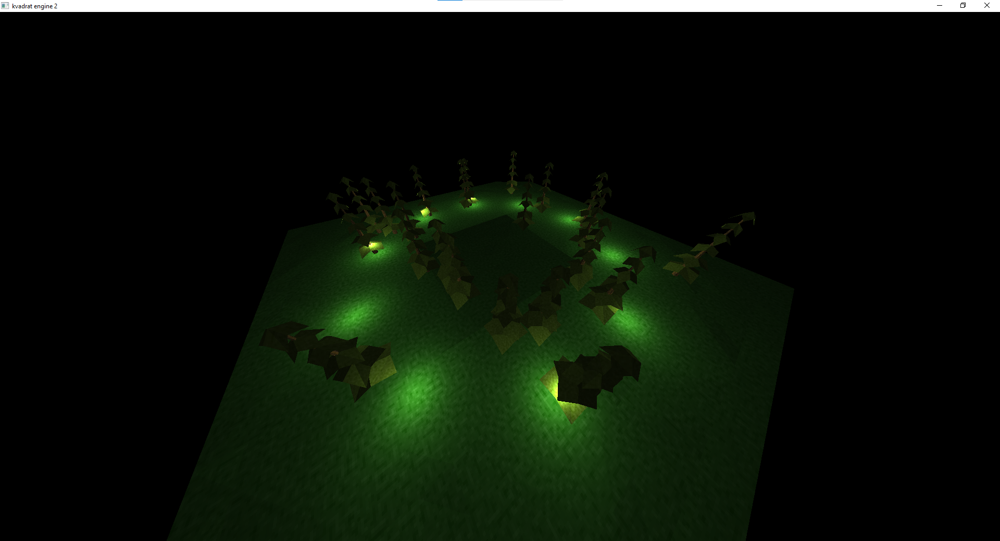

# Documentation

There is a multiple .md files.
Each file describes a part of engine SDK.
Read it all and you can try to create a tiny scene.

## `code` folder

`docs/code` describes engine's source code.
Read it if you want dive deeper into OpenGL.

## Examples

I have already created a small location on my engine.
It had a forest and it was created to test the system that finds the closest light sources to objects.

I also imported the buggy from Half Life 2 into the engine (it has ~6000 polygons):

