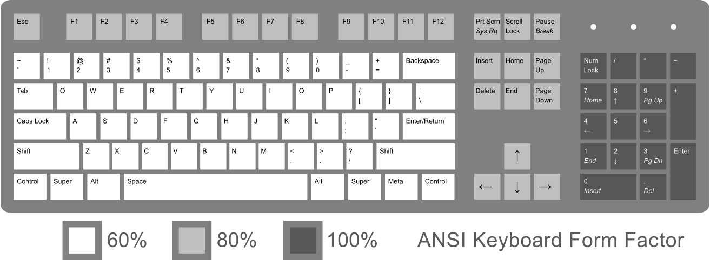

# binds.txt

This file contains the bindings of keys in the engine.

## Availiable bindings

* `wireframe_enable` - enable wireframe mode
* `wireframe_disable` - disable wf mode
* `cursor_lock` - lock and hide mouse cursor in window
* `cursor_unlock` - unlock and show cursor
* `window_close` - shutdown engine
* `move_bck` - move camera backward
* `move_rgh` - right
* `move_lft` - left
* `move_fwd` - forward

## Availiable button names

> 
Reference image\
(source: <https://commons.wikimedia.org/wiki/File:ANSI_Keyboard_Layout_Diagram_with_Form_Factor.svg>)

|Row|Buttons|
|---|---|
|1| `esc f1 f2 f3 ... f11 f12` |
|2| `~ 1 2 3 ... 9 0 - = \ backspace` |
|3| `tab q w e ... o p [ ]` |
|4| `caps a s d ... k l ; ' enter` |
|5| `lshift z x c ... n m , . / rshift` |
|6| `lctrl lsuper lalt space ralt rsuper strange_button rctrl` |
|Text movement| `insert home page_up delete end page_down` |
|Other| `print_screen scroll_lock pause_break` |
|Arrows| `up left down right` |
|Keypad| `num_lock kp_1 kp_2 kp_3 ... kp_9 kp_0 kp_* kp_/ kp_+ kp_- kp_enter kp_.` |

## Syntax

``` text
binding_name button_name
```

## Example

``` text
move_fwd w
move_bck s
move_rgh d
move_lft a
...
```
