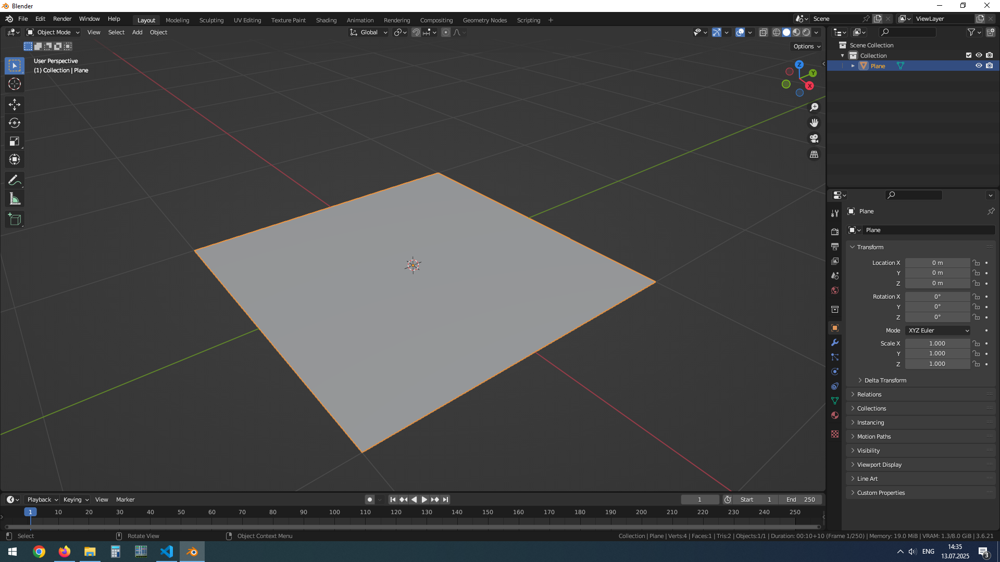
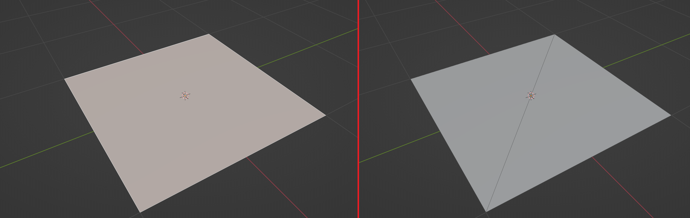
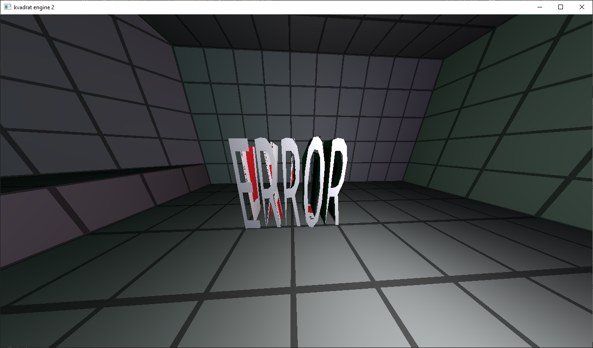

# Models

Models are contained in `.kmdl` (kvadrat model) files.

## Scene object

Model have following parameters:

* `model`
  * `model_name`
  * `vertex_shader_name`
  * `fragment_shader_name`
  * `texture_name`
  * `coords`
    * `x`
    * `y`
    * `z`

`model_name` - path to .kmdl file, relative to engine root folder\
`vertex_shader_name` - path to .vert file, relative to engine root folder\
`fragment_shader_name` - path to .frag file, relative to engine root folder\
`texture_name` - path to texture file, relative to engine root folder\
`coords` - 3 floating point values, coordinates of model

See `docs/scene.md`.

## How to convert to .kmdl

For example we have this model in Blender:
> 
It is just a plane with 4 vertices.

First we need to convert our quad faces to triangles (in Blender: enter edit mode, select all faces (hotkey `A`) and press `Ctrl+T` (or choose `Face > Triangulate Faces`)).

> 
Before and after triangulation.

Next, export the model in `.obj` format (in Blender: `File > Export > Wavefront (.obj)`) to any folder (I export to `models`).
Now that the model is in `.obj` format, run the program `models/obj2kmdl.exe` with the following parameters:

``` text
/engine/models $ ./obj2kmdl.exe input_model.obj output_model.kmdl N
```

Replace `N` with the `vertices_max` value from the `config.cfg` file (see `docs/config.md`).

## Missing model

If a scene file contains a model object whose model file is missing (see `docs/scene.md`), the engine will print a warning and load `models/missing.kmdl`. If `models/missing.kmdl` does not exist, the engine will print an error message and exit.

>
Missing model in action.

## .kmdl structure

`.kmdl` is a binary file format. It contains floating point values in the following format:

``` text
coords(x,y,z) texture_coords(x,y) normal(x,y,z)
coords(x,y,z) texture_coords(x,y) normal(x,y,z)
coords(x,y,z) texture_coords(x,y) normal(x,y,z)
coords(x,y,z) texture_coords(x,y) normal(x,y,z)
...
```

The engine reads the model file and fills the vertex array with data.
