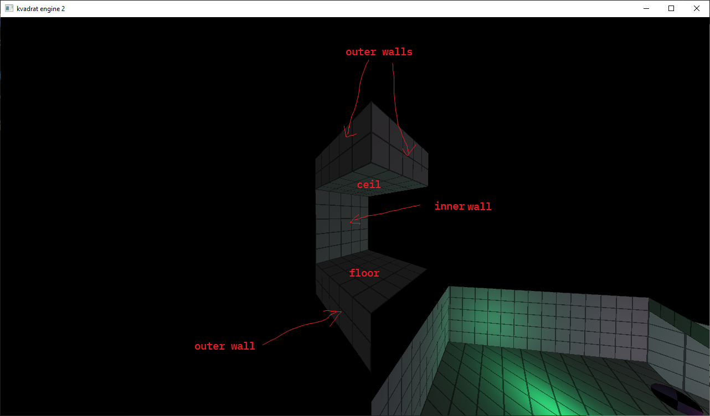

# Sectors

> **!Warning!**
Currently sectors are useless and you can avoid them using only models, but in the future this will be the only way to create maps that can collide with the player.

Sectors are small sections of the scene.
Each sector is a quadrilateral.

## Scene object

Sector have following parameters:

* `sector`
  * `bottom` (float)
  * `top` (float)
  * `connection_top` (4, float)
  * `connection_bottom` (4, float)
  * `points` (4, float)
    * `x`
    * `y`
  * `portal` (4, 0-4)
  * `texture_names` (6, string)
  * `vertex_shader_names` (6, string)
  * `fragment_shader_names` (6, string)
  * `texture_coords` (6, float)
    * `x`
    * `y`

`bottom` - height of ceil\
`top` - height of floor\
`connection_top` - height of outside top walls\
`connection_bottom` - height of outside bottom walls\
`points` - vertices of the sector\
`portal` - portal state of wall\
`vertex_shader_name` - path to .vert file, relative to engine root folder\
`fragment_shader_name` - path to .frag file, relative to engine root folder\
`texture_name` - path to texture file, relative to engine root folder\
`texture_coords` - 6 vectors, it is not coords, it is textures/meter

All parameters that are repeated several times are applied in the following sequence:

* floor
* ceil
* wall between 1st and 2nd points or outer wall between these points
* wall between 2nd and 3rd points or outer wall between these points
* wall between 3rd and 4th points or outer wall between these points
* wall between 4th and 1st points or outer wall between these points


> **!Warning!**

The wall highlighted in red belongs to the sector highlighted in blue, not green!
If you mess up, the lighting will not fall correctly on the outer walls.

See `docs/scene.md`.

## Exmaple

For example, we have the following sector:

``` text
sector
  10 15
  17 17 17 17
  8 8 8 8
  -15 15 -15 20 -10 20 -10 15
  0 1 2 3
  textures/dev.png
  textures/dev.png
  textures/dev.png
  textures/dev.png
  textures/dev.png
  textures/dev.png
  shaders/def.vert
  shaders/def.vert
  shaders/def.vert
  shaders/def.vert
  shaders/def.vert
  shaders/def.vert
  shaders/def.frag
  shaders/def.frag
  shaders/def.frag
  shaders/def.frag
  shaders/def.frag
  shaders/def.frag
  1 1 1 1 1 1 1 1 1 1 1 1
```

In the engine this look like:


>
`points` must be arranged in counter-clockwise order.

### `top` and `bottom`

`top` is a height of ceil.\
`bottom` is a height of floor.


### `connection_top` and `connection_bottom`

`connection_top` - height of outside top walls\
`connection_bottom` - height of outside bottom walls




### `points`

Each sector has 4 points.
`points` **must** be arranged in counter-clockwise order.

>
`points` must be arranged in counter-clockwise order.

### `portal`

`portal` is a state of wall of sector.
`portal` can be 0, 1, 2, 3, 4.

* `0` - inner wall
* `1` - no inner wall, top and bottom outer walls
* `2` - no inner wall, top outer wall
* `3` - no inner wall, bottom outer wall
* `4` - no inner wall

>

### `texture_names`

6 paths to texture files, relative to the engine root folder.\
`textures` applied in the following order:

* floor
* ceil
* wall between 1st and 2nd points or outer wall between these points
* wall between 2nd and 3rd points or outer wall between these points
* wall between 3rd and 4th points or outer wall between these points
* wall between 4th and 1st points or outer wall between these points

### `vertex_shader_names`

6 paths to vertex shader files, relative to the engine root folder.\
`vertex_shaders` applied in the following order:

* floor
* ceil
* wall between 1st and 2nd points or outer wall between these points
* wall between 2nd and 3rd points or outer wall between these points
* wall between 3rd and 4th points or outer wall between these points
* wall between 4th and 1st points or outer wall between these points

### `fragment_shader_names`

6 paths to fragment shader files, relative to the engine root folder.\
`fragment_shaders` applied in the following order:

* floor
* ceil
* wall between 1st and 2nd points or outer wall between these points
* wall between 2nd and 3rd points or outer wall between these points
* wall between 3rd and 4th points or outer wall between these points
* wall between 4th and 1st points or outer wall between these points

### `texture_coords`

6 2D vectors representing how many textures are applied to 1 meter.\
`texture_coords` applied in the following order:

* floor
* ceil
* wall between 1st and 2nd points or outer wall between these points
* wall between 2nd and 3rd points or outer wall between these points
* wall between 3rd and 4th points or outer wall between these points
* wall between 4th and 1st points or outer wall between these points


## Demo scene

>
This is a top view with coordinates of each vertex of the default scene.
