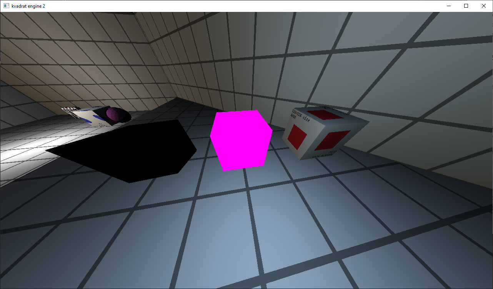

# Shaders

There are 2 types of shaders - vertex and fragment.\
Vertex shaders calculates vertex positions on the screen, `.vert` files.\
Fragment shaders calculates pixel color on the screen, `.frag` files.

All shaders uses `GLSL v330 core`.

## Missing shader

If a scene file contains a model object or a sector object for which a vertex or fragment shader file is missing (see `docs/scene.md`), the engine will print a warning and load `shaders/missing.vert` instead of the vertex shader or `shaders/missing.frag` instead of the fragment shader.
If `shaders/missing.frag` or `shaders/missing.vert` are missing, the engine will print an error message and exit.

Engine loads and compiles `shaders/missing.vert` and `shaders/missing.frag` shaders at start.

`shaders/missing.vert` and `shaders/missing.frag` are very hard to miss.
You can always tell which shader is missing: vertex or fragment (or texture is missing, don't mess up).

>
A regular cube on the right.\
A cube with a missing fragment shader in the middle. It's completely pink.\
A cube with a missing vertex shader on the left. It shakes a lot if you fly around it and has no lighting.

## Default shaders

It is recommended to use `shaders/def.vert` and `shaders/def.frag`.
They provide the best lighting quality.

Shaders also have `#define` directives.
With these, you can change their appearance for debugging.

`DEFAULT` - default lighting

`NO_LIGHT` - disable lighting

`TEST` - disable lighting and textures, only white directional light

`DISPLAY_NORMALS` - display fragment normal in RGB format (red - x, green - y, blue - z)

`DISPLAY_TEX_COORDS` - display fragment texture coordinates in RG format (red - u, green - v)


### Attenuation formula

The `shaders/def.frag` shader uses a slightly modified constant-linear-quadratic falloff formula.

Original formula:

``` math
F_{attenuation} = \frac{1.0}{constant + linear * distance + quadratic * distance^2}
```

Modified formula:

``` math
F_{attenuation} = constant + linear * distance + quadratic * distance^2
```

*constant* — `constant` field of the light source.
*linear* — `linear` field of the light source.
*quadratic* — `quadratic` field of the light source.
*distance* — distance from the light source to the fragment in the scene.

See `docs/light.md`, `docs/scene.md`.

### Increase the number of light sources per object

> **!Warning!**
Increasing the number of lights has a negative impact on performance.
The optimal number of lights per object is 4.

By default, `shaders/def.frag` only uses the 4 closest lights in the scene to the object.
To increase the number of lights, do the following:

1. Go to `shaders/def.frag` and change `#define LIGHTS_COUNT 4` to the desired number of lights per object.
2. Go to `config.cfg` and change `shader_lights_count` from `4` to the desired number of lights per object.

See 'docs/config.md`.
