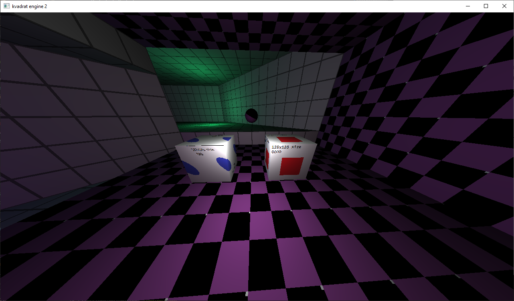

# Textures

> **!Warning!**
In the next versions of the engine it is planned to remove support for `.png` and instead create a custom texture format `.ktf` (kvadrat texture) for better memory management in the engine (`stb_image.h` currently manages memory).

Textures are contained in `.png` files.
Textures can also be in `.bmp`, `.jpg`, `.gif` formats, but `.png` is recommended.
Alpha channel is not used.

## Texture import

Texture size must be a power of two in all two dimensions (height and width may vary (64x128)). Other sizes look bad.

> 

## Missing texture

If a scene file contains a model or sector object whose texture file is missing (see `docs/scene.md`), the engine will print a warning and load `textures/missing.png`.
If `textures/missing.png` does not exist, the engine will print an error message and exit.

>
Missing texture in action.
