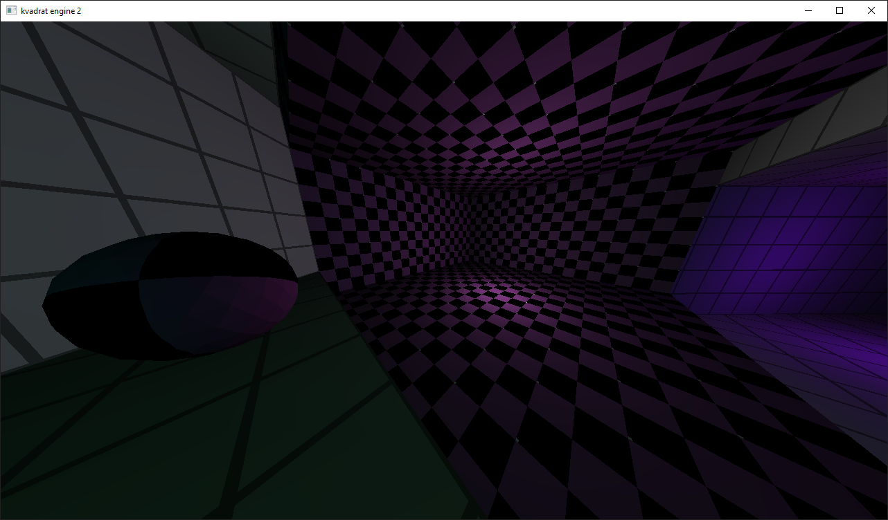

# Textures

Textures are contained in `.ktf` files.

## Texture import

To import a texture you need to save the texture in `.bmp` format, without compression, 24 bits per pixel and run `bmp2ktf` with following parameters:
``` text
/engine/textures $ ./bmp2ktf input.bmp output.ktf
```
In the scene file specify your `.ktf` texture.

## Missing texture

If a scene file contains a model or sector object whose texture file is missing (see `docs/scene.md`), the engine will print a warning and load `textures/missing.ktf`.
If `textures/missing.ktf` does not exist, the engine will print an error message and exit.\
The `textures/missing.ktf` texture should always be 32 by 32 pixels.

>
Missing texture in action.

